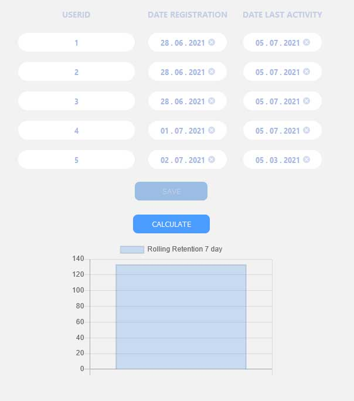

### BACKEND
SpaRNP.Analysis.Api - Rest Api
SpaRNP.Context - Entity Framework
SpaRNP.Models - Общая сущность данных

### TEST
SpaRNP.Analysis.Api.Test - консольное приложение для тестирования rest api

### FRONTEND
SpaRNP.WebSpa - фронтенд на react hooks

### Сборка

Докер контейнер Postgrsql в файле docker-compose.yml
```
docker-compose up
```

В папке SpaRNP.WebSpa\ClientApp выполнить команду
```
npm install
```

Запустить из корня проекта по очереди бэкент и фронтенд
```
dotnet run --project ./SpaRNP.Analysis.API/SpaRNP.Analysis.API.csproj
```
```
dotnet run --project ./SpaRNP.WebSpa/SpaRNP.WebSpa.csproj
```
